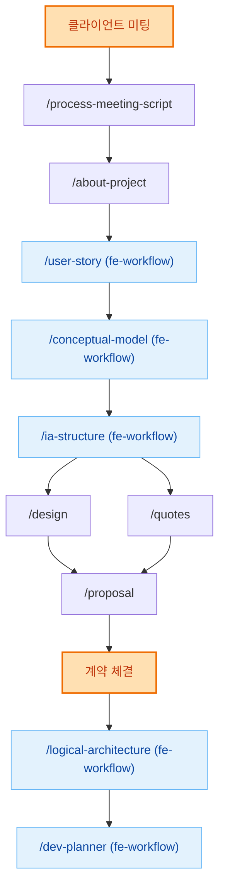

# AI-Driven Sales & Frontend Development Workflow (HITL)

이 프로젝트는 **클라이언트 미팅 → 견적/제안서 → 계약 → 개발** 전 과정을 AI가 주도하고, **Human은 문서·의사결정에만 개입(HITL)** 하는 구조를 따른다.

---

## 🎯 Core Principles

- **Single Source of Truth**: 
  - Sales: `sales/YY_MM_CLIENT_NAME/project-requirements.json`
  - Development: `tasks/tasks.json`
- **Human-in-the-loop(HITL)**: 문서 변경 · 요구사항 수정 · 승인 단계에만 개입
- **Implementation Autonomy**: 개발 단계에서는 AI가 확인 요청 없이 자율 실행
- **Design-first Validation**: 디자인 검수 대상 feature를 우선 개발

---

## 📊 전체 워크플로우



---

## 📁 Key Artifacts

```
sales/
  YY_MM_CLIENT_NAME/          # 클라이언트별 프로젝트 폴더
    meeting_scripts/           # 미팅 스크립트 및 산출물
    quotes/                    # 견적서
    project-requirements.json  # 프로젝트 요구사항 (Sales SSoT)
    
docs/                         # 개발 설계 문서
  user_stories.md
  conceptual_model.md
  ia_structure.md
  logical_architecture.md
  dev_plan.md
  DESIGN.md
  
tasks/
  tasks.json                  # 개발 Task 목록 (Dev SSoT)
  
.claude/
  skills/                     # Skill 정의
  scripts/                    # Workflow 스크립트
```

---

## 1️⃣ Sales Workflow (견적/제안서 생성)

### 1-1. 클라이언트 미팅 처리

**Skill**: `/process-meeting-script`

미팅 스크립트를 처리하여 요약, 요구사항, 피드백, 프로젝트 요구사항 JSON을 생성한다.

#### Inputs
- 클라이언트 폴더: `sales/YY_MM_CLIENT_NAME/`
- 미팅 날짜: `MM.DD`
- 스크립트 위치: `meeting_scripts/[MM.DD]/script.md`

#### Outputs
- `meeting_scripts/[MM.DD]/summary.md` - 미팅 요약 (6개 섹션)
- `meeting_scripts/[MM.DD]/requirements.md` - 요구사항 (REQ ID 포함)
- `meeting_scripts/[MM.DD]/sales-feedback.md` - 개선 피드백
- `project-requirements.json` - 프로젝트 요구사항 JSON (version 관리)

#### 실행
```markdown
/process-meeting-script
클라이언트: YY_MM_CLIENT_NAME
미팅 날짜: MM.DD
```

---

### 1-2. 프로젝트 이해 및 배경 생성

**Skill**: `/about-project`

모든 프로젝트 자료를 분석하여 내부 가이드와 제안서 배경을 생성한다.

#### Inputs
- `YY_MM_CLIENT_NAME/**` (전체 클라이언트 폴더)
- `quotes/[MM.DD]/note.md?` (선택)
- `meeting_scripts/**/summary.md`
- `project-requirements.md`
- `appendix/**`
- `notes.md`

#### Outputs
- `guide.md` - 내부 가이드
- `background.md` - 제안서 배경

#### 실행
```markdown
/about-project
```

---

### 1-3. User Story 생성 (FE Workflow)

**Skill**: `/user-story`

구조화된 사용자 스토리와 수용 기준을 생성한다.

#### Inputs
- `guide.md`
- `project-requirements.md`
- `meeting_scripts/**/summary.md`

#### Outputs
- `user_story.md` / `user_stories_data.json`

#### 실행
```markdown
/user-story
```

---

### 1-4. Conceptual Model 설계 (FE Workflow)

**Skill**: `/conceptual-model`

도메인 개념과 관계를 정의한다.

#### Inputs
- `guide.md`
- `user_story.md`
- `project-requirements.md`

#### Outputs
- `conceptual_model.md` / `conceptual_model.json`

#### 실행
```markdown
/conceptual-model
```

---

### 1-5. IA Structure 설계 (FE Workflow)

**Skill**: `/ia-structure`

정보 아키텍처와 화면 구조를 정의한다.

#### Inputs
- `guide.md`
- `user_story.md`
- `conceptual_model.md`
- `project-requirements.md`

#### Outputs
- `information-architecture.md` (Sales 컨텍스트: Platform Definition 포함)

#### 실행
```markdown
/ia-structure
```

---

### 1-6. Design 원칙 생성

**Skill**: `/design`

UI/UX 디자인 원칙과 타이포그래피 규칙을 생성한다.

#### Inputs
- `guide.md`
- `project-requirements.md`
- `information-architecture.md`

#### Outputs
- `DESIGN.md`

#### 실행
```markdown
/design
```

---

### 1-7. 견적서 생성

**Skill**: `/quotes`

IA와 사용자 액션 기반 기능별 견적서를 생성한다.

#### Inputs
- `guide.md`
- `information-architecture.md`
- `user_story.md`
- `quotes/[MM.DD]/note.md?` (선택)

#### Outputs
- `YY.MM.DD/quotes.md`

#### 실행
```markdown
/quotes
```

---

### 1-8. 최종 제안서 생성

**Skill**: `/proposal`

생성된 모든 산출물을 조합하여 최종 제안서를 생성한다.

#### Inputs
- `background.md`
- `information-architecture.md`
- `user_stories_data.json`
- `YY.MM.DD/quotes.md`

#### Outputs
- `YY.MM.DD/proposal.md`

#### 실행
```markdown
/proposal
```

---

### 1-9. 계약 체결

**Human Action**: 클라이언트와 계약 체결

계약 체결 후 개발 워크플로우로 진행한다.

---

## 2️⃣ Frontend Development Workflow (계약 후)

### 2-1. Logical Architecture 설계

**Skill**: `/logical-architecture`

컴포넌트 구조와 로직 아키텍처를 설계한다.

#### Inputs
- `docs/user_stories.md`
- `docs/conceptual_model.md`
- `docs/ia_structure.md`

#### Outputs
- `docs/logical_architecture.md`

#### 실행
```markdown
/logical-architecture
```

---

### 2-2. Dev Plan 수립

**Skill**: `/dev-planner`

프론트엔드 개발 계획 수립 및 Task 생성.

#### Inputs
- `docs/ia_structure.md`
- `docs/logical_architecture.md`

#### Outputs
- `tasks/tasks.json` (개발 Task 목록)

#### 실행
```markdown
/dev-planner
```

> **Note**: 프론트엔드(UI/컴포넌트)만 계획한다. 백엔드/API는 제외.

---

## 3️⃣ Development (HITL)

### 3-1. Planning 피드백 (HITL)

**목적**: Human이 문서와 tasks.json을 구조적으로 수정

**사용 커맨드**:
```markdown
/change-doc
<피드백 내용>
```

**결과**:
- `docs/` 문서 업데이트
- `tasks/tasks.json` 자동 반영

---

### 3-2. 디자인 검수 대상 Feature 우선 개발

**조건**:
- `design_validation_required = true`
- 해당 feature **전부 완료 시 종료**

**실행**:
```markdown
/feature-executor
@tasks/tasks.json에서 design_validation_required = true로 설정된 feature들까지 개발해줘
```

---

### 3-3. Feedback Loop (반복 가능)

#### 3-3-1. Replan HITL (Confirm 단계)

**목적**: 요구사항 변경, 디자인 수정, TBD 정리

**실행**:
```markdown
/change-analyzer
<피드백 내용>
```

**처리 내용**:
- 변경사항 요구사항 문서화
- 디자인 인사이트 저장 (필요 시)
- TBD 질문 정리
- `/change-docs` 자동 호출

👉 승인 시 Loop 종료

---

#### 3-3-2. Remaining Task 개발

```markdown
/feature-executor

Use @tasks/tasks.json as the single source of truth.

Execution rules:
1. A feature is "remaining" if at least one task is not completed.
2. Execute all remaining features.
3. If a feature spec exists, DO NOT run /feature-spec.
4. If no spec exists, run /feature-spec first.
5. Skip completed tasks.
6. Respect task dependencies.
7. Run independent tasks in parallel.
8. Do NOT ask for confirmation unless information is missing.
```

---

## ✅ 종료 조건

- `design_validation_required` feature 전부 완료
- Replan 승인 완료
- `tasks/tasks.json` 내 **모든 task = completed**

---

## 🧠 Why This Works

- **Sales → Dev 연계**: 미팅부터 개발까지 일관된 워크플로우
- **Human은 결정·검증·변경 관리에만 집중**
- **AI는 계획 → 실행 → 반복을 자동 수행**
- **문서 ↔ task ↔ 코드 간 정합성 유지**
- **회의가 아닌 커맨드 기반 개발 운영**

---

## 📚 참고 문서

- **Sales Workflow**: `.claude/scripts/sales-workflow/sales-workflow.json`
- **Process Meeting Script**: `.claude/skills/process-meeting-script/SKILL.md`
- **FE Workflow**: `.claude/scripts/FE-workflow/workflow.json`
- **Design Guide**: `docs/DESIGN.md`
